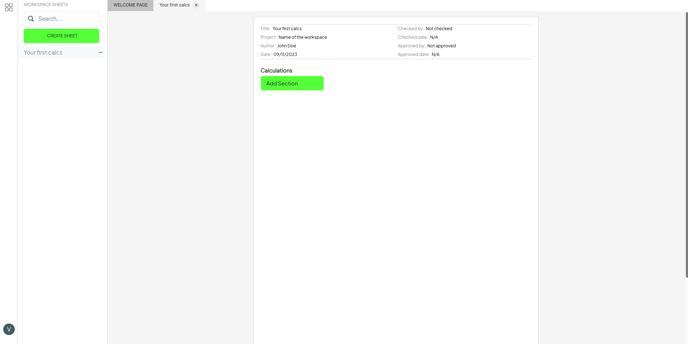
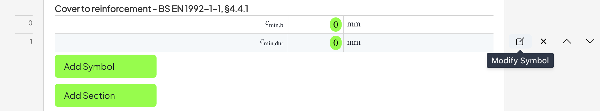
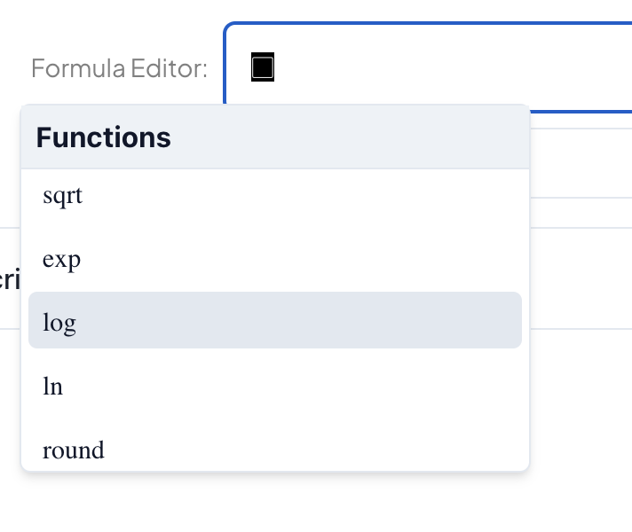
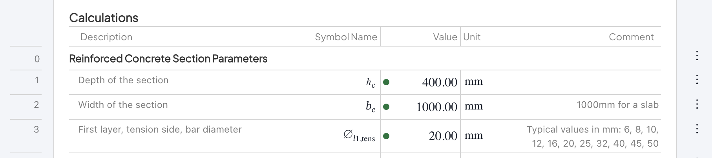

# Quick Start

Welcome to the Quick Start Guide for Enjicalc, your collaborative software solution to write, review, and manage engineering calculations. We know you're eager to get started with the software, so this guide will walk you through the essential steps to get you up and running quickly.

## Key App Components

Enjicalc comprises two general interfaces: a personal dashboard and a workspace. Click Create New Workspace on your dashboard page. In your workspace, click Create Sheet to start your first set of calculations. You should see a Sheet interface:

<figure><figcaption></figcaption></figure>

### Sheet Page

A Sheet Page represents a blueprint for your engineering calculations. It includes a header with attributes such as Sheet Title, Name of the Project, Dates, Author Name, and Checker and Approver Names. Below header starts the Calculations page, which consists of two main elements: 

- Symbols
- Sections 
   
Symbols represent the fundamental part of calculations inside Enjicalc. You can compare it to a Cell in Microsoft Excel. However, Excel only stores a formula describing an engineering formula inside a cell.  Enjicalc uses a more sophisticated approach to work with engineering formulae. Enjicalc's Symbol database holds a formula itself, as well as crucial information related to it, including: 

- Description
- Variable Name
- Units
- Comments.

> **_NOTE:_** If you believe we should store something else, let us know through our Canny Feedback Board.

### Symbol & Mathematical Representation

In Microsoft Excel, variables inside formulae represent cell location (AB302, T60), making the Excel formula very hard to review. In Enjicalc, we leveraged Mathematical Markup Language (MathML) to build and manipulate any formulae. Our proprietary technologies and algorithms allow users to create a low-level data structure through a user-friendly interface. This data structure is then used for valuation and displaying a formula on a screen with MathML, acting as a single source of truth. 

This architecture opens up **huge time-saving possibilities** for engineers in construction. To start with, we are drastically accelerating the review of an individual formula. Try to review how BS EN 1992-1-1, Expression (7.9) was calculated:

Microsoft Excel:

``` ts
=(C308 - B3 * (C309/B20) * (1 + T250/B * B20) ) / T250  = 0.00072
```

Enjicalc:

$$
\begin{align*}
  (\varepsilon_{sm}-\varepsilon_{cm})=\frac{\sigma_{s,crack}-k_t \times \frac{f_{ctm}(t)}{\rho_{p,eff}} \times \left(1+\frac{E_{cm}}{E_s}\times\rho_{p,eff} \right)}{E_s}=
\end{align*}
$$
$$
\begin{align*}
  =\frac{231.80-0.40 \times \frac{3.21}{0.016} \times \left(1+\frac{200000}{34007.1}\times 0.016 \right)}{200000} = 0.00072
\end{align*}
$$

Using variable names that match those in Eurocode or other standards and showing the formula with values substituted for the variables greatly reduces the time needed for review. Our Enjicalc team firmly believes that in some cases, calculations' review time can be decreased by a factor of 50!

Now, let's write our first symbol.

### Symbol Editor

Press the Add Section and Add Symbol buttons inside a Sheet Page (we will discuss Sections later). You can see an empty Symbol was created. Hover over the empty Symbol, and you will find the Modify Symbol button (see below).  

<figure><figcaption></figcaption></figure>

After the above is done, you can find a Symbol Editor modal. Here is an overview of symbol attributes: 

- Description - use this to provide an overview of a symbol 
- Comment - use this to give references or notes on how to use or not to use a symbol
- Unit - use this to state what units were considered in calculations explicitly
- Symbol - use this to state a mathematical variable name. More guidance [here]()

<figure><figcaption></figcaption></figure>


And now, most importantly, let's discuss Formula.

We aim to build an interface that makes writing a formula even more straightforward than in Microsoft Excel. With our custom Formula Editor interface, it is now possible to manipulate MathML-based variables with the help of general arithmetic operations and functions. The current list of functions can be found [here]().   

To paste a MathML variable into a formula, please select an appropriate variable from our Selector using your mouse (see below). Once pasted, click back into the Formula Editor to continue writing. 

> **_NOTE:_** With current version of Formula Editor, we advice first to create empty spaces for variable `▢`, and only then paste initiated symbols.

<figure><figcaption></figcaption></figure>

While some functions are straightforward, here is a quick guide on using a conditional statement.
- Type `cnd` followed by left bracket `(`
- You can now see `cnd(▢)` was created
- Inside the functions, press comma `,` twice
- You can now see `cnd(▢,▢,▢)`
- You should see the following as `cnd(condition,value_if_true,value_if_false)`
- Here is example `cnd( 1=2 , 3 , 4 ) = 4`

> **_NOTE:_** The Formula Editor interface is still WIP and might not perform as one would expect. Please report critical and not critical bugs to our Canny Feedback Board.

### Sections

As we mentioned, you must press the Add Section before creating the first Symbol to ensure that all Symbols belong to an appropriate group. You can still add Symbols to a Section and move them around as needed. At Enjicalc, we believe it is essential to group Symbols into correct Sections to improve the readability of calculations.

<figure><figcaption></figcaption></figure>

## Why you should start writing calculations with Enjicalc now 

The current version of Enjicalc is our Minimum Viable Product (MVP). There is still a long way to go. However, here is a list of powerful features we aim to deliver by the end of 2024:

- Vectorisation
  - Imagine you could convert your Excel spreadsheet into a function and control what functions' input and output 
- Version control
  - We will record every single change that was made to your work. No more SharePoint chaos.
- API to Sheets 
  - Similar to Vectorisation, but now your software developer team can access your functions from external software
