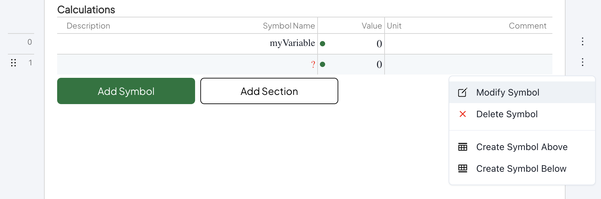
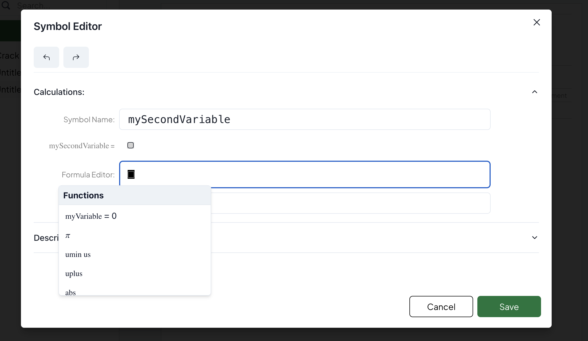

# Quick Start

Welcome to the Quick Start Guide for Enjicalc, your collaborative software solution for writing, reviewing, and managing engineering calculations. We know you're eager to get started with the software, so this guide will walk you through the essential steps to get you up and running quickly.

## Key App Components

Enjicalc comprises two general interfaces: a personal dashboard and a workspace. On your dashboard page, click Create New Workspace. Feel free to rename the workspace before jumping into it. Inside your workspace, click Create Sheet to start your first set of calculations.

### Sheet Page

A Sheet Page represents a blueprint for your engineering calculations. It includes a header with attributes such as Sheet Title, Name of the Workspace, Dates, Author Name, and Checker and Approver Names. Below header starts the Calculations page, which consists of two main elements: 

- Symbols
- Sections 
   
The Symbol represents the fundamental part of calculations inside Enjicalc. You can compare it to a Cell in Microsoft Excel. While Excel only stores a formula inside a cell, Enjicalc uses a more sophisticated approach to work with engineering formulae. In Enjicalc's database, Symbol holds a formula itself, as well as crucial information related to it, including: 

- Description
- Variable Name
- Units
- Comments.

> **_NOTE:_** If you believe we should store something else, let us know through our Canny Feedback Board.

### Symbol & Mathematical Representation

In Microsoft Excel, variables inside formulas represent cell location (AB302, T60), making the Excel formula very hard to review. Our proprietary technologies and algorithms allow users to create mathematical notation-based formulas through a user-friendly interface. This interface, or Formula Editor as we call it, creates low-level instruction similar to those programming languages are using. These instructions are then used for valuation and displaying a formula on a screen using mathematical expressions, acting as a single source of truth.

This architecture opens up **huge time-saving possibilities** for engineers in construction. First, we are drastically accelerating the review of an individual formula. Try to review how BS EN 1992-1-1, Expression (7.9) was calculated:

Microsoft Excel:

``` ts
=(C308 - B3 * (C309/B20) * (1 + T250/TH213 * B20) ) / T250  = 0.00072
```

Enjicalc:

$$
\begin{align*}
  (\varepsilon_{sm}-\varepsilon_{cm})=\frac{\sigma_{s,crack}-k_t \times \frac{f_{ctm}(t)}{\rho_{p,eff}} \times \left(1+\frac{E_{s}}{E_{cm}}\times\rho_{p,eff} \right)}{E_s}=
\end{align*}
$$
$$
\begin{align*}
  =\frac{231.80-0.40 \times \frac{3.21}{0.016} \times \left(1+\frac{200000}{34007.1}\times 0.016 \right)}{200000} = 0.00072
\end{align*}
$$

Using variable names that match those in Eurocode or other standards and showing the formula with values substituted for the variables greatly reduces the time needed for review. Our Enjicalc team firmly believes that in some cases, calculations' review time can be decreased by a factor of 50!

Now, let's write our first Symbol.

### Symbol Editor

You can create your first constant by pressing the Add Symbol buttons inside a Sheet Page. Now hover over the Symbol name to change it to "myVariable." You can do the same for Symbol Value and Symbol Unit.

Now, let's create a second variable and convert it to a formula.

To access the Symbol Editor, commets and description, press three vertical dots to open the Symbol menu, and you will find the Modify Symbol button.

<figure><figcaption></figcaption></figure>

After the above is done, you can find a Symbol Editor modal. Here is an overview of symbol attributes: 

- Description - use this to provide an overview of a symbol 
- Comment - use this to give references or notes on how to use or not to use a symbol
- Unit - use this to state what units were considered in calculations explicitly
- Symbol - use this to state a mathematical variable name. More guidance [here](https://enjicalc.gitbook.io/documentation/learn-enjicalc/mathml-symbols)

<figure><figcaption></figcaption></figure>

And now, most importantly, let's discuss Formula Editor.

We aim to build an interface that makes writing a formula even more straightforward than in Microsoft Excel. With our custom Formula Editor interface, it is now possible to manipulate variables with the help of general arithmetic operations and functions. The current list of functions can be found [here](https://enjicalc.gitbook.io/documentation/learn-enjicalc/built-in-functions).   

To paste a mathematical variable into a formula, please select an appropriate variable from our Selector using "up" or "down" buttons and pressing "enter". 

<figure><figcaption></figcaption></figure>

> **_NOTE:_** The Formula Editor interface is still WIP and might not perform as expected. Please report both critical and non-critical bugs to our Canny Feedback Board.

### Sections

You can add Sections, add Symbols to a Section and move them around as needed. At Enjicalc, we believe it is essential to group Symbols into correct Sections to improve the readability of calculations.

<figure><figcaption></figcaption></figure>

## Why you should start writing calculations with Enjicalc now 

The current version of Enjicalc is our Minimum Viable Product (MVP). There is still a long way to go. However, here is a list of powerful features we aim to deliver by the end of 2024:

- Vectorisation
  - Imagine converting your Excel spreadsheet into a global function and reusing this function in other Excel spreadsheets.
- Version control
  - We will record every single change that was made to your work. No more SharePoint chaos.
- API to Sheets 
  - Similar to Vectorisation, but now any software developer team can access your functions from external software
